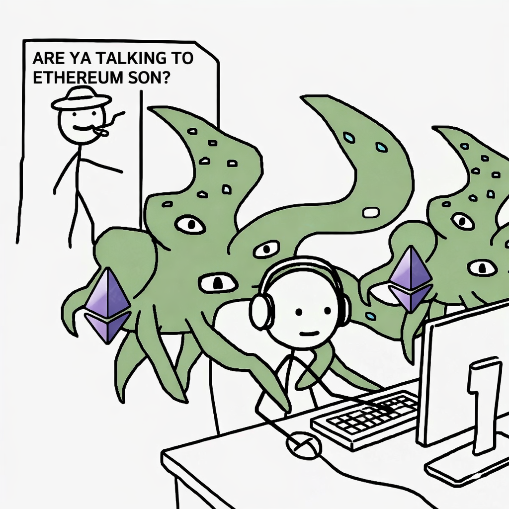

# Ethereum MCP

Query Ethereum in plain English. Built for researchers.



---

## Quick Install

### Using Claude Code?

Paste this into Claude Code:

```
Install the Ethereum MCP from github.com/ETHCF/ethereum-mcp and configure it for me
```

Claude will handle everything.

---

### Using Terminal?

Run this one command:

```bash
curl -fsSL https://raw.githubusercontent.com/ETHCF/ethereum-mcp/main/install.sh | bash
```

Follow the prompts. Restart Claude when done.

---

### Using Claude Desktop?

1. Clone and build:

```bash
git clone https://github.com/ETHCF/ethereum-mcp.git ~/.ethereum-mcp
cd ~/.ethereum-mcp && npm install && npm run build
```

2. Open config file:

```bash
open ~/Library/Application\ Support/Claude/claude_desktop_config.json
```

3. Add this (replace `your-key-here` with your [free Etherscan API key](https://etherscan.io/apis)):

```json
{
  "mcpServers": {
    "ethereum": {
      "command": "node",
      "args": ["/Users/YOUR_USERNAME/.ethereum-mcp/dist/index.js"],
      "env": {
        "ETHERSCAN_API_KEY": "your-key-here"
      }
    }
  }
}
```

4. Restart Claude Desktop.

---

## Verify It Works

Say: **"talk to ethereum"**

You should see a welcome message with available data sources.

---

## What You Can Ask

```
"Balance of vitalik.eth"
"What tokens does vitalik.eth hold?"
"Which L2 has the lowest fees?"
"What's the TVL of Uniswap vs Aave?"
"Internal transactions for 0xf8f74F2c34959F700F2617a71D19Be13BC42beb9"
"Top yield opportunities on Arbitrum"
"What's trending on CoinGecko?"
"Is gas cheap right now?"
"List supported chains" or "Switch to Base"
```

---

## Supported Chains (60+)

Query any of these blockchains with the same API key:

**Mainnets:** Ethereum, Polygon, Base, Arbitrum, Optimism, BNB, Avalanche, Gnosis, Linea, Blast, Scroll, Mantle, Celo, Moonbeam, Moonriver, Fantom, Cronos, Fraxtal, opBNB, World, Sonic, Unichain, Abstract, Berachain, Sei, ApeChain, XDC, BitTorrent, Taiko, Arbitrum Nova

**Testnets:** Sepolia, Holesky, Base Sepolia, Arbitrum Sepolia, Optimism Sepolia

Use `list_chains` to see all or `set_chain` to switch the default.

---

## Data Sources

| Source     | What It Covers                                                      | API Key             |
| ---------- | ------------------------------------------------------------------- | ------------------- |
| Etherscan  | 60+ chains: balances, transactions, tokens, contracts, logs, blocks | Free (required)     |
| DefiLlama  | TVL, yields, stablecoins, DEX volumes, options, fees, prices        | None (Pro optional) |
| CoinGecko  | Token prices, exchanges, derivatives, NFTs, categories              | None (Pro optional) |
| growthepie | L2 metrics, fees, activity                                          | None                |
| Blobscan   | EIP-4844 blob data                                                  | None                |
| Dune       | Custom queries                                                      | Free (optional)     |

Get your API keys:

- Etherscan: [etherscan.io/apis](https://etherscan.io/apis) (free, required)
- DefiLlama Pro: [defillama.com/subscription](https://defillama.com/subscription) (optional, unlocks 19 extra tools)
- CoinGecko Pro: [coingecko.com/api/pricing](https://coingecko.com/api/pricing) (optional, higher rate limits + 5 extra tools)
- Dune: [dune.com/settings/api](https://dune.com/settings/api) (free, optional)

---

## Limitations

- **Query limits**: Up to 10,000 results per query
- **Price lag**: Data may be 1-5 minutes behind
- **Full history**: Use Dune queries for complete transaction history beyond 10k

---

## Tools (152 total)

### Etherscan (43 tools)

**Account & Balance**
| Tool | Description |
|------|-------------|
| `get_eth_balance` | ETH balance for any address or ENS name |
| `get_balance_multi` | Batch balance for up to 20 addresses |
| `get_balance_history` | Historical balance at specific block |
| `get_address_tokens` | All ERC-20 tokens held by address |
| `get_address_nfts` | All NFTs held by address |
| `get_token_balance` | Specific ERC-20 token balance |
| `get_mined_blocks` | Blocks mined by an address |
| `get_transaction_count` | Transaction count (nonce) for address |

**Transactions & Transfers**
| Tool | Description |
|------|-------------|
| `get_transactions` | Recent external transactions (up to 10k) |
| `get_internal_transactions` | Internal txs (contract calls) with totals |
| `get_token_transfers` | ERC-20 token transfer history |
| `get_nft_transfers` | ERC-721 NFT transfer history |
| `get_erc1155_transfers` | ERC-1155 multi-token transfers |
| `get_beacon_withdrawals` | Staking withdrawals from validators |

**Blocks & Chain**
| Tool | Description |
|------|-------------|
| `get_block_number` | Latest block number |
| `get_block` | Detailed block info by number |
| `get_block_reward` | Block reward and uncle info |
| `get_block_countdown` | Time until future block |
| `get_block_by_timestamp` | Find block by timestamp |

**Transactions & Receipts**
| Tool | Description |
|------|-------------|
| `get_transaction` | Transaction details by hash |
| `get_tx_receipt` | Transaction receipt with logs |
| `get_tx_status` | Check if tx succeeded/failed |

**Contracts**
| Tool | Description |
|------|-------------|
| `get_contract_abi` | ABI for verified contracts |
| `get_contract_source` | Verified source code and metadata |
| `get_contract_creator` | Contract deployer and tx hash |
| `get_code` | Contract bytecode |
| `eth_call` | Read-only contract call |
| `get_storage` | Storage slot value |
| `estimate_gas` | Gas estimation |

**Logs & Events**
| Tool | Description |
|------|-------------|
| `get_logs` | Event logs with topic filtering |

**Stats & Network**
| Tool | Description |
|------|-------------|
| `get_gas_price` | Current gas prices |
| `get_gas_estimate` | Confirmation time for gas price |
| `get_eth_price` | ETH price in USD/BTC |
| `get_eth_supply` | Total ETH supply |
| `get_node_count` | Ethereum node count |
| `get_daily_stats` | Daily chain stats (blocks, gas, fees, addresses, etc.) |

**Tokens**
| Tool | Description |
|------|-------------|
| `get_token_supply` | Total supply of ERC-20 |
| `get_token_info` | Token metadata (name, symbol, decimals) |
| `get_token_holders` | Token holder list with balances |

**Multi-Chain**
| Tool | Description |
|------|-------------|
| `list_chains` | List all 60+ supported chains |
| `set_chain` | Switch default blockchain |

### DefiLlama (42 tools)

**API Key Setup**
| Tool | Description |
|------|-------------|
| `set_defillama_key` | Set DefiLlama Pro API key (optional) |

**TVL & Protocols** (Free)
| Tool | Description |
|------|-------------|
| `get_chain_tvl` | TVL for all chains |
| `get_historical_tvl` | Historical TVL data |
| `get_protocol_tvl` | TVL for a specific protocol |
| `get_protocol_info` | Detailed protocol breakdown |
| `search_protocols` | Search by name/category |

**Yields** (Free + Pro)
| Tool | Description |
|------|-------------|
| `get_top_yields` | Top APY opportunities |
| `get_yield_pool_chart` | Historical APY chart for pool (Pro) |
| `get_borrow_rates` | Borrow rates across protocols (Pro) |
| `get_lend_borrow_chart` | Lend/borrow rates chart (Pro) |
| `get_perps_rates` | Perpetual funding rates (Pro) |
| `get_lsd_rates` | Liquid staking rates (Pro) |

**Stablecoins** (Free)
| Tool | Description |
|------|-------------|
| `get_stablecoins` | Stablecoin market caps |
| `get_stablecoin_dominance` | Stablecoin dominance per chain |
| `get_stablecoin_detail` | Detailed stablecoin data |
| `get_stablecoin_chains` | Chains with stablecoin data |

**DEX Volumes** (Free)
| Tool | Description |
|------|-------------|
| `get_dex_volumes` | 24h DEX volumes |
| `get_dex_volumes_by_chain` | DEX volumes per chain |
| `get_dex_protocol` | Specific DEX data |

**Derivatives** (Pro)
| Tool | Description |
|------|-------------|
| `get_derivatives_volumes` | Derivatives trading volumes |
| `get_derivatives_protocol` | Specific derivatives protocol data |

**Options** (Free)
| Tool | Description |
|------|-------------|
| `get_options_volumes` | Options trading volumes |
| `get_options_protocol` | Specific options protocol |

**Fees & Revenue** (Free)
| Tool | Description |
|------|-------------|
| `get_fees` | Protocol fees overview |
| `get_protocol_fees` | Specific protocol fees |

**Prices** (Free)
| Tool | Description |
|------|-------------|
| `get_coin_prices` | Token prices by address |
| `get_coin_prices_historical` | Historical token prices |
| `get_coin_chart` | Price chart data |
| `get_coin_percent_change` | Price change percentages |
| `get_coin_first_price` | First recorded price |
| `get_block_by_timestamp` | Block number at timestamp |

**Emissions & Unlocks** (Pro)
| Tool | Description |
|------|-------------|
| `get_emissions` | Token emissions/unlocks overview |
| `get_emission` | Specific protocol emission schedule |

**Ecosystem** (Pro)
| Tool | Description |
|------|-------------|
| `get_categories` | DeFi categories by TVL |
| `get_forks` | Protocol forks data |
| `get_oracles` | Oracle usage across DeFi |
| `get_treasuries` | Protocol treasury holdings |
| `get_hacks` | Historical DeFi hacks |
| `get_raises` | Crypto funding rounds |

**Bridges** (Pro)
| Tool | Description |
|------|-------------|
| `get_bridges` | All cross-chain bridges |
| `get_bridge` | Specific bridge details |
| `get_bridge_volume` | Bridge volume by chain |

### growthepie (9 tools)

**L2 Overview**
| Tool | Description |
|------|-------------|
| `get_l2_overview` | All L2s TVL + activity |
| `get_l2_fees` | Compare L2 transaction fees |
| `get_l2_chain` | Detailed metrics for specific L2 (all 11 metrics) |
| `get_blob_data` | EIP-4844 blob fees by L2 |

**Rankings & Comparisons**
| Tool | Description |
|------|-------------|
| `get_l2_metric_ranking` | Rank L2s by any metric (tvl, daa, profit, etc.) |
| `get_l2_all_metrics` | Comprehensive metrics for all L2s |
| `get_l2_profitability` | L2 profitability comparison |
| `get_l2_activity` | L2 activity by daily active addresses |
| `get_l2_chains_list` | List all tracked L2 chains with metadata |

### CoinGecko (30 tools)

**API Key Setup**
| Tool | Description |
|------|-------------|
| `set_coingecko_key` | Set CoinGecko Pro API key (optional) |

**Prices & Search** (Free)
| Tool | Description |
|------|-------------|
| `get_token_price` | Price for any token by name/symbol |
| `get_token_price_by_contract` | Token price by contract address |
| `get_top_tokens` | Top cryptos by market cap |
| `get_trending_tokens` | Trending on CoinGecko |
| `search_tokens` | Search tokens by name |

**Coin Data** (Free)
| Tool | Description |
|------|-------------|
| `get_coin_details` | Detailed coin information |
| `get_coin_history` | Historical data for specific date |
| `get_coin_chart` | Price chart data |
| `get_coin_ohlc` | OHLC candlestick data |
| `get_coin_tickers` | Exchanges where coin is traded |
| `get_coin_by_contract` | Coin data by contract address |

**Global & Categories** (Free)
| Tool | Description |
|------|-------------|
| `get_global_market` | Global crypto market stats |
| `get_global_defi` | Global DeFi market stats |
| `get_categories` | Crypto categories with market data |
| `get_asset_platforms` | List of blockchain platforms |
| `get_exchange_rates` | BTC exchange rates |

**Exchanges** (Free)
| Tool | Description |
|------|-------------|
| `get_exchanges` | Top exchanges by volume |
| `get_exchange` | Specific exchange details |
| `get_exchange_tickers` | Exchange trading pairs |
| `get_exchange_volume_chart` | Exchange volume history |

**Derivatives** (Free)
| Tool | Description |
|------|-------------|
| `get_cg_derivatives` | Derivatives tickers |
| `get_derivatives_exchanges` | Derivatives exchanges |

**NFTs** (Free + Pro)
| Tool | Description |
|------|-------------|
| `get_nfts_list` | NFT collections list |
| `get_nft_details` | NFT collection details |
| `get_nft_markets` | NFT markets by cap (Pro) |
| `get_nft_chart` | NFT price history (Pro) |

**Pro Features**
| Tool | Description |
|------|-------------|
| `get_top_movers` | Top gainers and losers (Pro) |
| `get_new_coins` | Recently added coins (Pro) |
| `get_global_chart` | Historical global market cap (Pro) |

### Blobscan (13 tools)

**Blobs**
| Tool | Description |
|------|-------------|
| `get_recent_blobs` | Recent EIP-4844 blobs |
| `get_blob` | Details for specific blob by versioned hash |
| `get_blobs_by_address` | Blobs posted by a specific address |

**Transactions**
| Tool | Description |
|------|-------------|
| `get_blob_transactions` | Recent blob-carrying transactions |
| `get_blob_transaction` | Transaction details by hash |

**Blocks**
| Tool | Description |
|------|-------------|
| `get_blob_block` | Block with blob details |
| `get_latest_blob_block` | Latest block with blobs |

**Statistics**
| Tool | Description |
|------|-------------|
| `get_blob_stats` | Aggregate blob statistics |
| `get_blob_counts` | Total blobs, blocks, transactions count |
| `get_blob_daily_stats` | Daily blob statistics |
| `get_blob_block_stats` | Block-level blob statistics |
| `get_blob_tx_stats` | Transaction-level blob statistics |

**Search**
| Tool | Description |
|------|-------------|
| `blobscan_search` | Search blobs, blocks, txs, addresses |

### Dune (10 tools)

**API Key & Query Execution**
| Tool | Description |
|------|-------------|
| `set_dune_key` | Set your Dune API key |
| `run_dune_query` | Execute a query by ID |
| `get_dune_results` | Get cached query results |
| `get_dune_results_csv` | Get cached results as CSV |
| `get_dune_query_info` | Get query metadata (name, description, parameters) |
| `get_dune_execution_status` | Check execution status |
| `cancel_dune_execution` | Cancel a running execution |

**Preset Endpoints (no custom query needed)**
| Tool | Description |
|------|-------------|
| `get_eigenlayer_avs` | EigenLayer AVS metadata and metrics |
| `get_eigenlayer_operators` | EigenLayer operator metadata and metrics |
| `get_dune_token_balances` | Real-time token balances (Developer API) |

### Smart Routing (5 tools)

Tools with automatic fallbacks between data sources for improved reliability.

| Tool                        | Description                                                    |
| --------------------------- | -------------------------------------------------------------- |
| `smart_get_price`           | Token price with fallbacks (CoinGecko -> DefiLlama)            |
| `smart_get_eth_price`       | ETH price with fallbacks (Etherscan -> CoinGecko -> DefiLlama) |
| `smart_get_l2_tvl`          | L2 TVL with fallbacks (growthepie -> DefiLlama)                |
| `api_health_check`          | Check health and latency of all data sources                   |
| `compare_eth_price_sources` | Compare ETH price across all sources                           |

---

## Contributing

PRs welcome! To add a new data source:

1. Create adapter in `src/adapters/`
2. Add tools to `src/index.ts`

---

## Credits

Built by [Pat McGowan](https://x.com/patmilkgallon) at [Number Group](https://numbergroup.xyz/) for the [Ethereum Community Foundation](https://ethcf.org/).

MIT License
